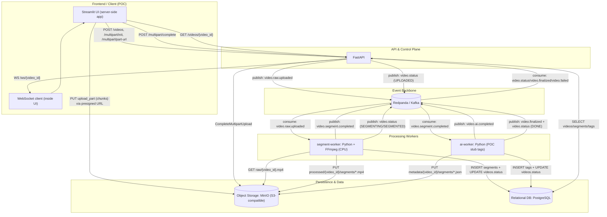

## Architecture (on-prem POC)

### Goal
Upload → Kafka → Segment → AI → Metadata → Realtime Notify

### Components
- **FastAPI**: control-plane (presigned upload + orchestration) + WebSocket notify
- **MinIO**: raw videos, segments, JSON metadata
- **Kafka (Redpanda)**: event backbone + buffering/backpressure
- **Postgres**: business state + indexes + idempotency (`processed_events`)
- **segment-worker**: FFmpeg segmentation (CPU)
- **ai-worker**: tagging stub (replace with GPU inference later)

### End-to-end flow
1) Client creates video_id via API
2) Client uploads directly to MinIO with presigned multipart
3) Client completes multipart via API → API emits `video.raw.uploaded`
4) Segment worker consumes → writes segments + DB → emits `video.segment.completed`
5) AI worker consumes → writes tags + JSON → emits `video.finalized`
6) Workers publish progress to `video.status` → API consumes and pushes WebSocket updates

### Diagram (matches current POC)

Notes:
- The uploader is the Streamlit app process (inside Docker), so presigned URLs must point to `minio:9000`.
- Auth/JWT/CORS are not implemented in the current POC.

