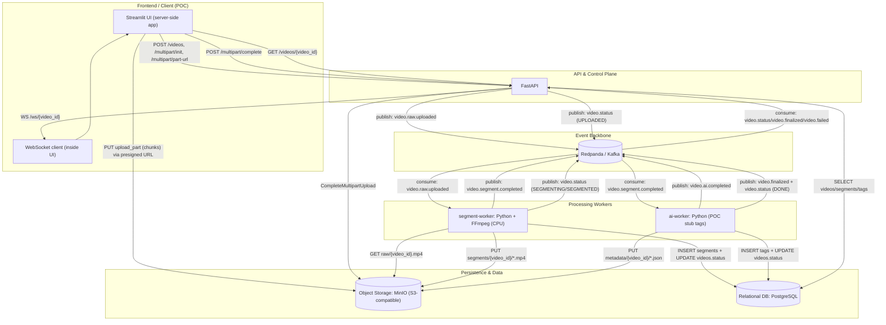

## Architecture (on-prem POC)

### Goal
Upload → Kafka → Segment → AI → Metadata → Realtime Notify

### Components
- **FastAPI**: control-plane (presigned upload + orchestration) + WebSocket notify
- **MinIO**: raw videos, segments, JSON metadata
- **Kafka (Redpanda)**: event backbone + buffering/backpressure
- **Postgres**: business state + indexes + idempotency (`processed_events`)
- **segment-worker**: FFmpeg segmentation (CPU)
- **ai-worker**: AI tagging (stub or YOLO). YOLO weights are pulled from MinIO/S3 on container startup (Model Registry pattern).

### End-to-end flow
1) Client creates video_id via API
2) Client uploads directly to MinIO with presigned multipart
3) Client completes multipart via API → API emits `video.raw.uploaded`
4) Segment worker consumes → writes segments + DB → emits `video.segment.completed`
5) AI worker consumes → writes tags + JSON → emits `video.finalized`
6) Workers publish progress to `video.status` → API consumes and pushes WebSocket updates

### Requirements coverage (current POC)
- **Split into 1-minute segments**: supported via config `VP_SEGMENT_SECONDS=60` (default may differ).
- **Per-segment metadata**: `metadata/{video_id}/segments/{segment_id}.json` contains `timestamp`, `duration`, and basic `tags`.
- **Per-segment metadata**: `metadata/{video_id}/{segment_id}.json` contains `start_time/end_time/duration`, cleaned `labels`, and `quality` flags.
- **Clear S3/MinIO structure**: `raw/`, `segments/`, `metadata/` prefixes (see `docs/storage.md`).
- **Optional quality filtering (blur/dark)**: implemented in AI stage (configurable via env; can tag `low_quality` and optionally skip YOLO).

### Diagram (matches current POC)

Notes:
- The uploader is the Streamlit app process (inside Docker), so presigned URLs must point to `minio:9000`.
- For YOLO mode, the model artifact is stored in MinIO/S3 (e.g. `s3://models/yolov8_v1.pt`) and cached inside the `ai-worker` container at startup.
- Auth/JWT/CORS are not implemented in the current POC.

